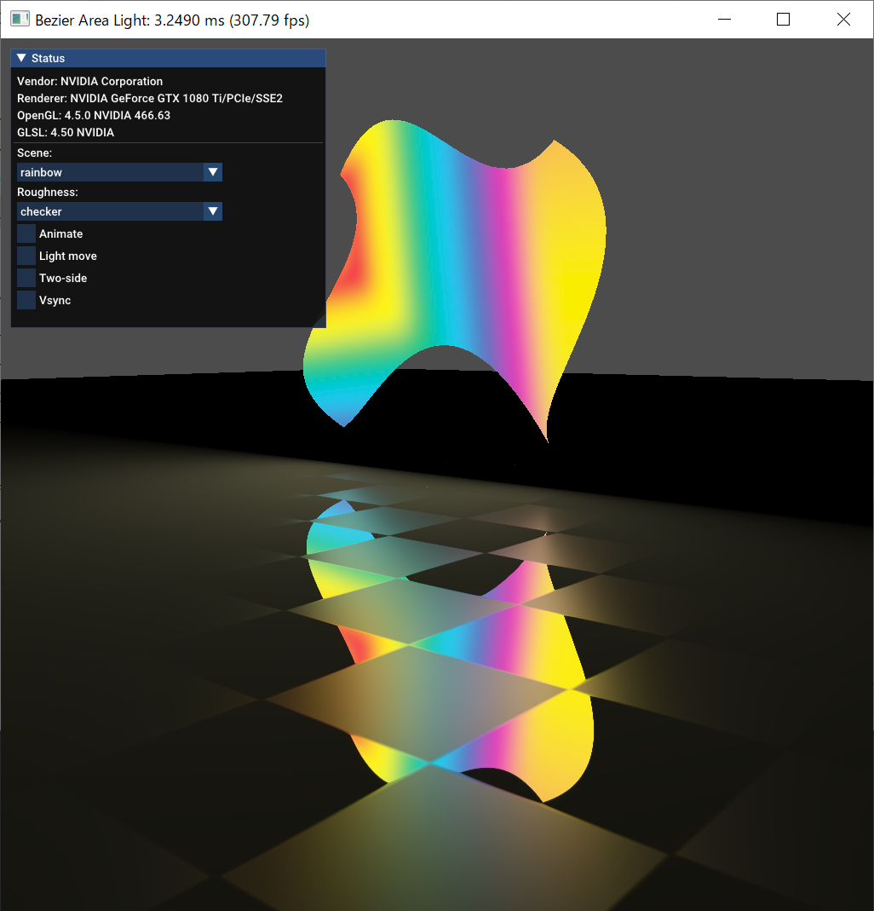

Free-form area light rendering
===

<a rel="license" href="http://creativecommons.org/licenses/by-nc-sa/4.0/"></a><br/>

[](https://github.com/Paul180297/BezierLightLTC/actions/workflows/windows.yaml)
[](https://github.com/Paul180297/BezierLightLTC/actions/workflows/macos.yaml)
[](https://github.com/Paul180297/BezierLightLTC/actions/workflows/ubuntu.yaml)

This is an official implementation of the paper, 

> Kuge et al., "Real-Time Shading of Free-Form Area Lights using Linearly Transformed Cosines," Journal of Computer Graphics Techniques, No. 4, Vol. 10, 2021.

Please see the [JCGT paper](#) and [our website](https://tatsy.github.io/projects/bezlight21/) for more details.

### Requirements

* OpenGL 4.3 or higher
* GLFW3
* GLM

### Build

```shell
git clone https://github.com/Paul180297/BezierLightLTC.git
cd BezierLightLTC
mkdir build && cd build
cmake .. -D CMAKE_BUILD_TYPE=Release
cmake --build . --config Release

```

### Run

```shell
# From project root
./build/bin/bezier_ltc
```

### Screen shot



### Reference

```bibtex
@article{kuge2021bezlight,
  author={Kuge, Takahiro and Yatagawa, Tatsuya and Morishima, Shigeo},
  title={Real-time Shading with Free-form Planar Area Lights using Linearly Transformed Cosines},
  journal={Journal of Computer Graphics Techniques},
  number={4},
  volume={10},
  page={1--16},
  year={2021}
}

```

### Copyright

This work is licensed under a <a rel="license" href="http://creativecommons.org/licenses/by-nc-sa/4.0/">Creative Commons Attribution-NonCommercial-ShareAlike 4.0 International License</a>.

CC BY-NC-SA 4.0, 2021 (c) Takahiro Kuge and Tatsuya Yatagawa
